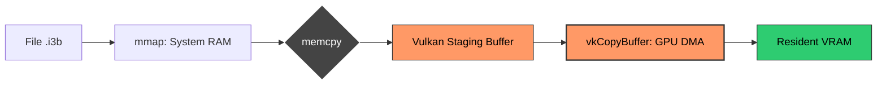

The idea of making a rendering engine is a bit of an **endless cycle**: for the first scene, you make a `draw_triangle` and already, with an API like Vulkan, that keeps you busy for a while. Then you tell yourself a cube is nice, you'll be able to test your matrices and UBOs.

But after a while, ambition catches up with you. You want to do **GPU Driven**, **Hi-Z Occlusion Culling**, **Ray Tracing**, **ReSTIR**... and then, cubes are nice but they quickly become limiting. "Oh yeah guys, I have a super demo with GPU Driven, GI, RT and everything! 🚀"... and then you show a Cornell Box. Naturally, you won't get the "Wow" effect. You need **real complex scenes**, and that's precisely why I started the **asset baking** system for **[i3](https://github.com/doomtr666/i3)** quite early.

More seriously, it's also the only real way to test the **robustness** of the engine. Bam, a small degenerate normal, and it's a **NaN** that blows up your lighting shader. Every new asset brings its share of unforeseen problems. It's an iterative process that takes time: we refine the Baker as the scenes become hungrier.

### The Dynamic Duo: i3_baker vs i3_io

The architecture of i3 relies on a drastic separation of responsibilities via two distinct crates:

1.  **`i3_baker` (The Heavyweight)**: This is the build tool. It's the one that "takes all the heat". It depends on **Assimp** (for 3D), **Slang** (for shaders), **Image** (for textures), and **Rayon** (for parallelizing everything). For textures, it integrates the **Intel ISPC Texture Compressor** (`intel-tex-2`) for high-quality BCn compression (BC1 to BC7), with a dedicated **fast-path** if the asset is already in DDS format (via `ddsfile`). It's a multi-megabyte monster that only serves development.
2.  **`i3_io` (The Formula 1)**: This is the runtime. It's ultra-lean. Its only dependencies? `memmap2` for binary mapping, `bytemuck` for casting, and especially **`rayon`** to parallelize asynchronous asset loading via its global thread pool. This is the only crate that ends up in your game binary.

The secret? `i3_io` defines the **Binary Contract** (the headers). The Baker must comply. At runtime, the engine doesn't even know Assimp exists; it only sees perfectly aligned bytes.

### The Zero-Copy Dogma vs Silicon Reality

We often talk about **Zero-Copy** as the Holy Grail: you `mmap` your file, you give the address to Vulkan and hop, the magic happens. But watch out for shortcuts: even with **Resizable BAR** enabled, we don't just "map" the SSD into VRAM and hope it shines. The physics of the PCIe bus impose its rules.

Exposing the GPU's *Device Local* memory in the CPU's address space (via the BAR) is giving a delivery address, not hiring a mover. If you let your CPU do a `memcpy` to this area, you'll saturate your cores for a ridiculous throughput. The CPU isn't made for pushing bytes on a high-latency bus like PCIe.

#### Staging: A failure? Not so fast.

In **i3**, the "Zero-Copy Pact" relies on the only brute force capable of saturating the bus: the GPU's **Copy Engine (DMA)**. Currently, our pipeline looks like this:

1.  **Neutral Ground (RAM)**: The OS uses the NVMe controller's DMA to fill system RAM pages from the SSD. This is the kernel's historical and ultra-optimized job via `mmap`.
2.  **The "Burst" Transfer**: This is where the magic happens. During `vkCmdCopyBufferToImage`, we wake up the RTX's **Copy Engine**. It, and it alone, takes command of the PCIe bus. It "sucks up" data from RAM in massive bursts (32 GB/s on PCIe 4.0, 64 GB/s on 5.0) to inject it into VRAM.
3.  **The "Small" Memcpy**: And that's where I lied. Yes, there's a `memcpy` between step 1 and 2. :( What a big liar! The most intuitive reader will immediately spot the contradiction: how can we talk about **Zero-Copy** while doing a `memcpy`?



#### The DirectStorage Mirage

Microsoft's **DirectStorage** is often cited as the miracle solution. It's a "magical" proprietary tech that promises to solve all our streaming problems. But for i3, it's a total non-starter.

First, it's a tech tailored for Microsoft consoles and their closed architecture. For a Vulkan-based engine, integrating DirectStorage on Windows requires a high level of architectural masochism (DX12/Vulkan interop, cross-queue management...). More importantly, it solves absolutely nothing for the **Linux** world.

Not to mention the **HRI** (Hardware Rendering Interface): trying to achieve a clean decoupling between optimized loading and the rendering backend with such an API is a recipe for a permanent migraine. We're also avoiding the complexity of **GDeflate** for now: while I'm curious about testing NVIDIA's open-source library for geometry compression (better entropy!), the actual real-world gain remains unproven. By sticking with native **BC7** for textures, we already have formats that the GPU texture units can devour immediately.

#### VK_EXT_external_memory_host: The Sane Choice

So, what do we do? This is where [**`VK_EXT_external_memory_host`**](https://registry.khronos.org/vulkan/specs/1.3-extensions/man/html/VK_EXT_external_memory_host.html) comes in. It's the ultimate "sweet spot."

Technically, it's just a classic extension support test and a small `if`. We tell Vulkan that the memory area mapped by the CPU (our `.i3b` file) is a legitimate source `VkBuffer`. We squeeze step 3 (the `memcpy`). While these two DMA controllers (Disk and GPU) talk to each other at the peak of bandwidth, the CPU is totally free. It hasn't touched a single byte; it just signed the purchase order. It's clean, it's cross-platform (Windows/Linux), and it respects the elegance of i3's architecture.


Code cleanliness wins by K.O.: we keep a simple, decoupled pipeline, and let the silicon do what it does best.

### Anatomy of a Bundle: The Fridge and its Index

To avoid opening 4000 files, i3 groups everything into two files:

1.  **The Bundle (`.i3b`)**: The giant fridge. A series of binary blobs aligned to **64 KB**.
2.  **The Catalog (`.i3c`)**: The post-it on the door. It tells us where the resource is stored (the offset) and its size.

Each asset in the bundle starts with a fixed 64-byte **AssetHeader** (defined in `i3_io`):

```rust
#[repr(C)]
pub struct AssetHeader {
    pub magic: u64,             // 0..8   0x4933415353455400 ("I3ASSET\0")
    pub version: u32,           // 8..12  Version: 1
    pub compression: u32,       // 12..16 0: None, 1: Zstd...
    pub data_offset: u64,       // 16..24 Absolute offset in the .i3b
    pub data_size: u64,         // 24..32 Compressed size
    pub uncompressed_size: u64, // 32..40
    pub asset_type: [u8; 16],   // 40..56 Type UUID (Mesh, Texture...)
    pub _reserved: [u8; 8],     // 56..64 Padding for alignment
}
```

The catalog is a simple list of **CatalogEntry** (128 bytes). At runtime, `i3_io` does its `mmap`, casts the memory into an array of structs, and puff: O(1) access to any asset by its UUID.

### Conclusion

The asset pipeline is often relegated to the background, treated as just another dirty Python script. Yet, by entirely offloading algorithmic complexity, mathematical corrections (winding order, heavy layouting, AABB computations), and complex topological analyses OFFLINE, we totally free the runtime from this friction.

It's this obsession with "direct-to-metal" architecture that defines i3. The engine doesn't waste a single clock cycle "loading" data; it just maps the GPU directly to it. In a demanding architecture, the battle is won before execution even begins.
