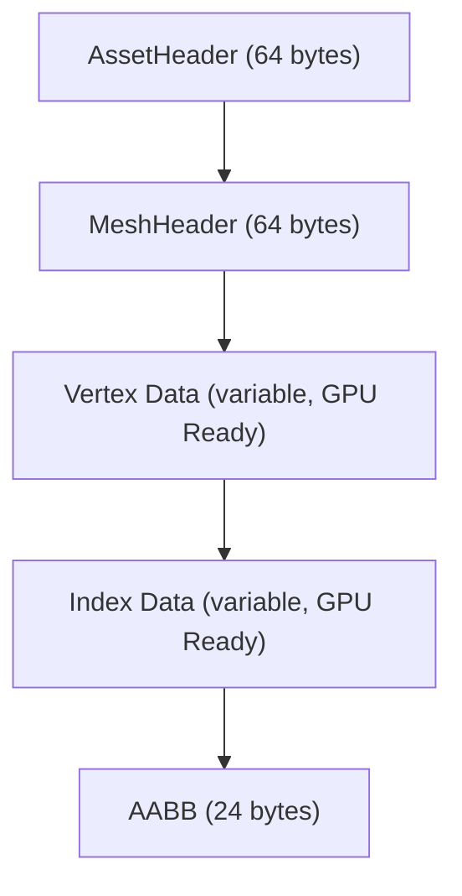

In my previous article, we talked about the orchestra (the Frame Graph). But an orchestra without sheet music is just a bunch of people with shiny instruments staring at each other. In i3, this sheet music consists of our **assets** (meshes, scenes, skeletons, animations). And their preparation is anything but trivial.

If you think a modern 3D engine loads an `.obj` or `.gltf` file directly at runtime, that's the absolute best way to tank your performance and skyrocket your loading times. These formats are meant for exchange between humans and modeling tools (Blender, Maya), not for being digested by a hungry GPU.

### The Zero-Copy Pact

For i3, I made a pact with myself: **Zero-Copy**. The idea is absolutely brutal: once the asset is on the disk, it must be "mappable" directly into virtual memory via a system call like `mmap`, and its sub-sections must be injectible into Vulkan buffers without *any* resident transformation CPU-side. No on-the-fly JSON parsing, no memory realignment, no vector swizzling. Pure silicon, direct.

Enter the **Baker** (`i3_baker`). Contrary to what you might think, it's not a standalone offline CLI tool. For now, it is invoked directly from the `build.rs` script. The idea is to tightly couple the process: building the binary triggers the incremental compilation of assets into `.i3b` *bundles* and `.i3c` catalogs.

### Importer vs Extractor: A Decoupled Architecture

The baker's architecture relies on a strict separation between **parsing** and **conversion**, using two distinct layers: **Importers** and **Extractors**.

On one side, the **Importer** reads the source format and produces an intermediate memory representation. For geometry, I use a native C++ integration of **Assimp** (via the `russimp` binding). Assimp parses a complex source file (`.glb`, `.fbx`) **exactly once**, generating a unified scene tree.

On the other side, the **Extractors** consume this intermediate representation to generate the final binary blobs. 
The critical architectural takeaway is that a single import triggers multiple extractions. For a full character:
- The `MeshExtractor` will iterate over primitives (`aiMesh`) and generate `.i3mesh` geometry.
- The `SceneExtractor` will traverse the scene graph (MeshRefs, accumulated transform matrices) and flatten it into `.i3scene` instancing.
- The `SkeletonExtractor` will build the joint hierarchy (`i16` parent indices) and inverse bind matrices into `.i3skeleton`.
- The `AnimationExtractor` will convert frames into a continuous value pool in `.i3animation`.

### Under the Hood: .i3mesh and Memory Layout

Let's peek under the hood of a compiled asset, like a `.i3mesh`. To guarantee Zero-Copy, the file is organized using structs explicitly tagged with `repr(C)`.

The `MeshHeader` struct stores exactly what the Vulkan API needs to know:
- `vertex_count` and `index_count`.
- `vertex_stride` and `vertex_format` (an enum pointing to the exact memory layout. For example, the `PositionNormalUvSkinned` format weighs exactly 52 bytes per vertex).
- Absolute offsets (`u32`) from the start of the blob to the vertex and index data (`vertex_offset`, `index_offset`).

For skinning, alignment is razor-sharp:
- `joints`: `[u8; 4]` (allowing 256 bones per skeleton, keeping weight minimal while covering the vast majority of use cases).
- `weights`: `[f32; 4]` (stored explicitly, even the 4th weight, to avoid recalculating it via `w4 = 1.0 - w1 - w2 - w3` in the vertex shader).

At runtime (via the `i3_io` engine crate), the VFS component performs its `mmap`, casts a view of the memory into the `MeshHeader` structure, and uses the pre-calculated pointers via offsetting to immediately populate the `VkBuffer` creation struct. It's direct injection.

### The Global State Concept: .i3pipeline

This Zero-Copy philosophy isn't limited to geometry. The mindset extends to a major concept: the `.i3pipeline` asset.

Historically (and this is a nightmare in Vulkan/DX12), binding shaders and fixed rasterization state (Blend, DepthStencil, InputAssembly) together at runtime takes ages. In the Baker pipeline, the goal isn't to compile a simple SPIR-V shader in isolation. 

Instead, the Baker takes a high-level shading file (via the `SlangImporter`) and outputs a full asset containing:
- The concatenated SPIR-V bytecodes of all entry points.
- A serialized block representing the entirety of the `VkGraphicsPipelineCreateInfo` (RasterizationState, render targets, blending modes).
Result: at runtime, the renderer simply pops the blob and constructs its Pipeline Object in one go.

### Rayon and CPU Saturation

The other massive impact of this highly decoupled architecture is parallelization. Baker is an aggressive tool. During a "bake", it scans the source asset directory and meticulously cross-references modification dates (`mtime`) with entries in the `.i3c` catalog.

It identifies the delta of files that need rebaking and pushes them all into a thread pool managed by **Rayon**. Since each source asset is entirely independent of the others, the Baker instantly saturates all physical CPU cores:
1. Each thread loads a source file in parallel.
2. The Importer parses data into the intermediate memory structure.
3. The Extractors generate the blobs (often capable of executing in parallel themselves).
4. A thread-safe `BundleWriter`, fortified against race conditions, concatenates the final blocks into the heavy `.i3b` bundle file.

Even with hundreds of complex assets, an incremental "rebake" only takes a few dozen milliseconds. No more mandatory 20-minute coffee breaks while the level compiles.

### Conclusion

The asset pipeline is often relegated to the background, treated as just another dirty Python script. Yet, by entirely offloading algorithmic complexity, mathematical corrections (winding order, heavy layouting, AABB computations), and complex topological analyses OFFLINE, we totally free the runtime from this friction.

It's this obsession with "direct-to-metal" architecture that defines i3. The engine doesn't waste a single clock cycle "loading" data; it just maps the GPU directly to it. In a demanding architecture, the battle is won before execution even begins.
