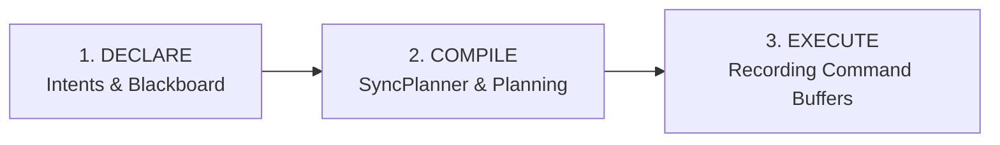

In my [previous article](../about-i3/), I talked about the famous "renunciation": moving to a **Frame Graph** for my **[i3](https://github.com/doomtr666/i3)** engine. It's a big word, somewhat trendy in the 3D engine world, but behind the buzzword lies a brutal reality. When you switch to explicit APIs like Vulkan, you're stuck with manual management of synchronization barriers. And that's when the trouble really starts.
<!--more-->
The problem is that modern GPUs are massively parallel machines. By default, they try to execute as many operations as possible simultaneously. Except that in a rendering algorithm, not everything can be parallelized: *Lighting* needs the *GBuffer*, *Post-processing* needs the lit scene, and so on.

Managing synchronization manually with barriers is the complex art of restricting this parallelism to ensure data consistency. Multiply that by a hundred rendering passes and thousands of resources, and you have a perfect recipe for impossible-to-debug synchronization bugs (visual glitches, graphical artifacts, etc.) or massive performance losses if your barriers are too conservative.

### The problem of implicit coupling

The real issue is coupling. To set a consistent Vulkan barrier, you're forced to define two things: the **target** usage of the resource (what your current pass will do with it), but also its **previous** usage (what the previous pass did).

That's where the trap closes. What if your *Lighting* pass needs to know exactly what state the *GBuffer* pass left the depth texture in to set its barrier, and then you want to add a *Decals* pass in the middle? Good luck manually modifying every barrier in the chain to reflect the new "previous" state. You end up with passes that are as rigid as iron bars in a block of reinforced concrete.

This is where you realize the full weight of the term "explicit" in the Vulkan API. Nothing is free. It's a verbose, punishing model, and spending your days manually specifying barriers is the best way to end up with an engine frozen in ice.

To preserve a semblance of sanity and flexibility, abstraction is no longer an option.

### The Vulkan Synchronization Model

To understand why a Frame Graph is vital, we have to go back to the basics. Vulkan relies on an explicit synchronization model orchestrating four main actors:

1.  **Queues**: Hardware execution units (Graphics, Async Compute, Transfer/DMA).
2.  **Command Buffers**: Lists of instructions submitted to the queues.
3.  **Barriers**: *Intra-queue* synchronization (memory consistency between commands on the same queue).
4.  **Semaphores**: *Inter-queue* synchronization (scheduling between different execution units).

Managing synchronization in Vulkan means juggling two types of dependencies according to the [Synchronization 2](https://registry.khronos.org/vulkan/specs/1.3-extensions/man/html/VK_KHR_synchronization2.html) specification:

-   **Execution Dependency (Semaphores)**: This is the guarantee that one set of operations finishes before another starts. It's the "when". We mainly use **Semaphores** to synchronize different GPU queues with each other.
-   **Memory Dependency (Barriers)**: This is the guarantee that memory accesses (writes) from a first group of operations are made **available** and **visible** to a second group. It's the "what". This is the role of **Barriers** within a single queue.

Clearly: you can use a semaphore to wait for the GPU to finish writing (execution dependency) without the data being "readable" by the next shader's cache (memory dependency). This is the classic trap where your image is ready, but the GPU tries to read it through a stale cache. Glitch guaranteed.

#### Multi-Queue

Modern hardware is no longer just a single compute unit. It has multiple independent **Queues**: **Async Compute** to parallelize heavy tasks (Culling, Denoising), **DMA Copy Engines** for background asset streaming, and even dedicated video encoding engines. The major benefit is **overlap**. If your Graphics queue doesn't saturate all of the GPU's compute units (an **occupancy** issue), Async Compute allows you to "fill the gaps" to exploit 100% of the silicon. Similarly, DMA Copy Engines allow you to inject textures into VRAM without ever disturbing the fluidity of your draw calls.

The scheduling of this choreography is done via **Semaphores**. In i3, I chose **Timeline Semaphores** (Vulkan 1.2+). Unlike classic binary semaphores, they allow tracking GPU progress via a simple monotonic counter, which is much more elegant for driving a complex rendering graph.

-   **Queue A (Graphics)**: Signals value 10 when rendering is ready.
-   **Queue B (Compute)**: Waits for value 10 before starting.

#### CONCURRENT vs EXCLUSIVE

When a resource is shared between multiple queues, Vulkan offers two modes:

-   **CONCURRENT**: Multiple queues can access the resource simultaneously. This is simple because a classic barrier is enough. In i3, this is the preferred mode for **buffers** (VBO/IBO/UBO) because they don't benefit from complex layout optimizations.
-   **EXCLUSIVE**: The resource belongs to only one queue at a time. This is the default mode for **images** in i3. Why bother with this? Because in `CONCURRENT` mode, the driver must guarantee a memory representation compatible with all queues. This automatically disables **DCC (Delta Color Compression)**, particularly on AMD hardware. By staying in `EXCLUSIVE`, we give the hardware the freedom to compress its data however it wants, at the cost of slightly more complex ownership transfer management.

#### Ownership Transfer and Layout Transitions

The flip side of `EXCLUSIVE` mode is that you must orchestrate an **Ownership Transfer**: a two-step operation consisting of a **Release** barrier on the source queue and an **Acquire** barrier on the target queue, synchronized by a **semaphore** to schedule the hardware queues.

In addition to this, there are **Layout Transitions**. Manufacturers have the freedom to change the internal memory representation of images during a barrier to optimize access (e.g., switching from a "write" layout to a "shader read" layout optimized for the cache).

```c
// Example: transition of usage, layout, and queue
VkImageMemoryBarrier2 image_barrier = {
    .sType = VK_STRUCTURE_TYPE_IMAGE_MEMORY_BARRIER_2,
    .srcStageMask  = VK_PIPELINE_STAGE_2_COLOR_ATTACHMENT_OUTPUT_BIT,
    .srcAccessMask = VK_ACCESS_2_COLOR_ATTACHMENT_WRITE_BIT,
    .dstStageMask  = VK_PIPELINE_STAGE_2_COMPUTE_SHADER_BIT,
    .dstAccessMask = VK_ACCESS_2_SHADER_READ_BIT,
    .oldLayout     = VK_IMAGE_LAYOUT_COLOR_ATTACHMENT_OPTIMAL,
    .newLayout     = VK_IMAGE_LAYOUT_SHADER_READ_ONLY_OPTIMAL,
    .srcQueueFamilyIndex = graphics_queue_idx,
    .dstQueueFamilyIndex = compute_queue_idx,
    .image         = my_texture,
    .subresourceRange = { VK_IMAGE_ASPECT_COLOR_BIT, 0, 1, 0, 1 }
};
```

Here, I define the transition from a write (Color Attachment) to a shader read (Compute Shader), an optimal memory layout change for the cache, and an ownership transfer between the Graphics queue and the Compute queue.

The savvy reader will notice that this is only a **"half-barrier"** (Release): it must absolutely have its counterpart (**Acquire**) on the destination queue to be valid. This example also skips the hardware scheduling via **Semaphore**, which is essential so that the target queue doesn't try to acquire the resource before the source has released it. Finally, the presence of `subresourceRange` reminds us that these transitions can be fine-tuned at the mip-level or array-layer level, further increasing management complexity.

This accumulation of constraints — Release/Acquire, Layout Transitions, Semaphores — exposes the brutal reality of Vulkan: it's a real **mess of potential bugs**. It's verbose, fragile during refactoring, and it's statistically guaranteed that you'll forget a barrier somewhere.

These three properties — complexity, verbosity, fragility — would make any rendering engine that manually specified its barriers, extremely **RIGID**.

Any modification becomes a risk. Coupling doesn't follow the linear order of the code but the **data flow** of the graph: changing one pass modifies a resource's state, which impacts every consumer pass by ripple effect, sometimes much later in the frame.

Some approaches I tested (like [V-EZ](../about-i3/)) try to solve this by hiding everything under the rug. The problem is that it ends up being like coding a crappy **OpenGL pseudo-driver**. You lose control over fine-grained hardware optimizations, which is precisely why we chose Vulkan in the first place. This realization pushed me to pivot toward a Frame Graph architecture.

Inspired by [DICE's work on Frostbite](https://www.ea.com/frostbite/news/framegraph-extensible-rendering-architecture-in-frostbite), the i3 Frame Graph treats rendering as a compilation problem.

### The i3 Frame Graph Architecture

To understand the i3 code, you have to see its Frame Graph not just as a simple barrier manager, but as a real frame compiler. Its role is to transform a high-level intent into an optimal flow of hardware commands.



#### 1. Agnostic Design

The i3 Frame Graph is **totally agnostic**. It handles neither `VkImage` nor `VkBuffer`, and has no knowledge of the Vulkan API. It works on a pure abstraction layer at the **HRI (Hardware Rendering Interface)** boundary:
- **Symbols**: Typed identifiers representing logical resources.
- **Intents**: Usage intentions (Fragment Shader Read, Color Attachment Write, etc.).
The graph compiles these intentions to generate a logical synchronization plan, leaving it to the backend to materialize this into hardware primitives (`VkImageMemoryBarrier2`).

#### 2. Publish / Consume: The Data Contract

To avoid the pitfalls of a global "Blackboard" (often a source of hidden coupling and hard-to-debug issues), i3 relies on a **Scoped Symbol Table**. There is a clear separation between the two lifecycle stages of a pass:

**DECLARE Phase (Declaration of intents)**
This is where everything happens for the frame compiler. The pass does not handle any hardware command buffers. It expresses its needs in two ways:
- **Resource Intents**: Via `builder.write_image` or `builder.read_buffer`. These declarations allow the **SyncPlanner** to simulate the theoretical GPU state and prepare the barriers.
- **Scoped Blackboard Access**: Via `builder.consume::<T>` to retrieve data (e.g., the sun's position) or `builder.publish::<T>` to produce data for subsequent passes.

**EXECUTE Phase (Command recording)**
Once the plan is established and compiled, the engine calls `execute`. Only at this stage does the pass access the hardware **Command Buffer**. Thanks to the work done upstream, the pass records its draw/dispatch calls safely: the necessary barriers have already been injected between the calls by the engine according to the plan established by the SyncPlanner.

#### 3. Recursive Hierarchy (NodeTree)

The graph is structured as a recursive tree composed of two types of nodes:
- **Leaf (Pass)**: An atomic unit recording an uninterruptible sequence of GPU commands.
- **Branch (Group)**: A container of nodes managing a local scope of symbols.
This hierarchy is the key to the engine's **extensibility**: you can inject an optional rendering pass into the "GBuffer" group without ever having to modify the code of the "Lighting" passes, as the compiler dynamically resolves dependencies between branches.

#### 4. Native Parallelism

Command recording (EXECUTE phase) is designed to saturate the CPU without any bottlenecks:
- **Fork-Join ([Rayon](https://github.com/rayon-rs/rayon))**: The compiler identifies groups of independent passes and distributes them across a thread pool using a work-stealing model.
- **Thread-local Command Pools**: Each worker thread has its own hardware command pool (`VkCommandPool`) per frame. Recording is therefore **100% parallel**, without any mutexes or atomic contention over graphical API resources.
- **Parallel Recording**: For massive passes (e.g., GBuffer with thousands of objects), i3 allows "forking" the recording within a pass via **Secondary Command Buffers**.

#### 5. The SyncPlanner

The **SyncPlanner** is the system's logistical brain. It simulates the frame's progression to maintain the state of each symbol (layout, access flags, queue). By comparing the state required by a pass with the state left by the previous one, it generates a **SyncPlan** — a suite of abstract synchronization instructions — which the backend then materializes into Synchronization2 barriers.

### Practical Example: The i3 SkyPass

Nothing beats a concrete example from the source code (`sky.rs`) to illustrate how these concepts come together. Here is a simplified version of the sky rendering pass in i3:

```rust
impl RenderPass for SkyPass {
    fn name(&self) -> &str { "SkyPass" }

    // Initialization phase (called once at boot)
    fn init(&mut self, backend: &mut dyn RenderBackend, globals: &mut PassBuilder) {
        // We consume the asset loading service from the Global scope
        let loader = globals.consume::<Arc<AssetLoader>>("AssetLoader");
        
        // Load the "sky" shader and create the hardware pipeline
        if let Ok(asset) = loader.load::<PipelineAsset>("sky").wait_loaded() {
            self.pipeline = Some(backend.create_graphics_pipeline(asset));
        }
    }

    // DECLARE phase (called every frame)
    fn declare(&mut self, builder: &mut PassBuilder) {
        // 1. Resolve image identifiers on the Blackboard
        let hdr_target = builder.resolve_image("HDR_Target");
        let depth_buffer = builder.resolve_image("DepthBuffer");

        // 2. Consume CPU data (Camera, Sun) published by other systems
        let common = builder.consume::<CommonData>("Common");
        let sun_dir = builder.consume::<glm::Vec3>("SunDirection");

        // 3. Formal declaration of the usage contract (Intents)
        // The SyncPlanner will use this info to generate optimal barriers.
        builder.write_image(hdr_target, ResourceUsage::COLOR_ATTACHMENT);
        builder.read_image(depth_buffer, ResourceUsage::DEPTH_STENCIL);
    }

    // EXECUTE phase (Parallel GPU command recording)
    fn execute(&self, ctx: &mut dyn PassContext) {
        let pipeline = self.pipeline.as_ref().expect("Pipeline not initialized");
        
        ctx.bind_pipeline(pipeline);
        ctx.push_constants(self.current_frame_data);
        ctx.draw(3, 0); // Render a full-screen triangle for procedural sky
    }
}
```

#### Key takeaways:
-   **Zero Barriers**: The developer never calls `vkCmdPipelineBarrier`. Calling `builder.write_image` in the `DECLARE` phase provides the SyncPlanner with the information needed to inject the transition at the appropriate time.
-   **Total Decoupling**: `SkyPass` doesn't know who created the `HDR_Target` texture or what state it's in. It expresses a need, and the engine guarantees that the need is met.
-   **Strong Typing**: Data consumption (`consume::<CommonData>`) is secured by Rust's type system, eliminating a whole class of bugs related to poorly typed global state management.

### Composition and Hierarchy: The PostProcessGroup

The i3 structure is recursive. A pass can be a leaf (Pass) or a branch (Group). This allows packaging entire features (Post-Process, UI, GBuffer) into independent modules:

```rust
pub struct PostProcessGroup {
    pub histogram_pass: HistogramBuildPass,
    pub tonemap_pass: TonemapPass,
}

impl RenderPass for PostProcessGroup {
    fn name(&self) -> &str { "PostProcessGroup" }

    fn declare(&mut self, builder: &mut PassBuilder) {
        // A group doesn't do direct rendering; it organizes the sub-graph.
        // We can thus isolate an entire feature (e.g., Post-Process or UI)
        // in an independent and reusable module.
        builder.add_pass(&mut self.histogram_pass);
        builder.add_pass(&mut self.tonemap_pass);
    }
    
    // The group doesn't have its own execute() phase; 
    // the added leaf passes each provide their own implementation.
}
```

### Resource Types: Transient, External, and Persistent

For the i3 developer, all resources are **Symbols**, but their Lifetime defines how they are managed in memory:

- **Transient Resources**: Created and destroyed within a single frame (e.g., GBuffer, intermediate shadow maps). Since their lifetime is short and known, they are perfect candidates for **Memory Aliasing**: the engine can reuse the same VRAM block for two transient textures whose usages do not overlap in time.
- **External Resources**: Resources managed outside the Frame Graph (assets, material textures, meshes). We "bind" them dynamically to the engine so the SyncPlanner can include their accesses in its global plan, but the graph does not take ownership.
- **Persistent (or Temporal) Resources**: Resources created by the graph that must survive from one frame to the next. This is where history functionality comes in.

### Temporal Symbols: History Management

In a modern engine, many algorithms need to access the results of the previous frame. In i3, for example, the **Tonemapping** pass uses luminance history to ensure smooth exposure adaptation.

i3 solves this problem natively via **Temporal Symbols**:
- **History Depth**: When declaring a symbol on the Blackboard, we can specify a history depth (e.g., `depth: 1` to keep the N-1 result).
- **Transparent Ring Buffering**: The engine internally manages a rin buffer of physical resources. The user never has to handle buffer indices.
- **Relative Access**: During the **DECLARE** phase, a pass simply asks to consume a resource with a relative index (e.g., `-1` for the previous frame).

```rust
fn declare(&mut self, builder: &mut PassBuilder) {
    // We consume the result of frame N-1 in read-only mode
    let prev_color = builder.consume_history("SceneColor", -1);
    
    // The engine ensures that prev_color points to the physical resource 
    // that was the write target in the previous frame.
}
```

### Perspectives: HEFT, DCE, and Memory Aliasing

This foundation allows for other optimizations that will be the subject of dedicated articles:
- **DCE (Dead Code Elimination)**: Automatic pruning of the graph to remove all passes whose final result is never consumed, as well as associated resources that are never read.
- **Memory Aliasing**: Analysis of symbol lifespans to reuse the same physical memory (VRAM) between multiple resources, reducing the memory footprint.
- **HEFT ([Heterogeneous Earliest Finish Time](https://en.wikipedia.org/wiki/Heterogeneous_Earliest_Finish_Time))**: An advanced scheduling algorithm to distribute tasks optimally across different hardware queues (Graphics, Async Compute, DMA).

## What's Next?

That’s where we are with the i3 Frame Graph. It’s a heavy industrial component, but indispensable for building a modern engine. And so far, it’s working pretty well.

In future articles, I’ll tackle topics just as interesting (at least to me :D): the asset baking and IO pipeline (the famous zero-copy), the structure of the standard i3 RenderGraph, or even moving to GPU Driven rendering.
