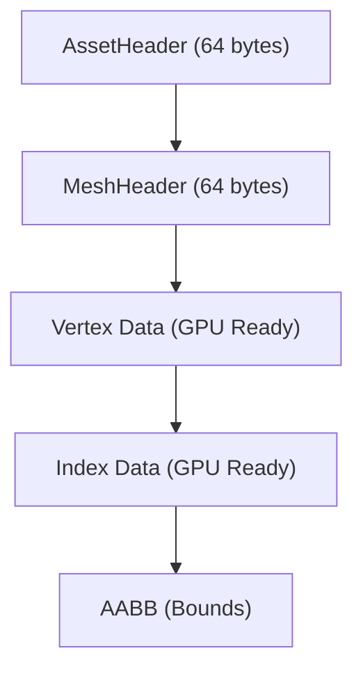

Dans mon précédent article, on a parlé de l'orchestre (le Frame Graph). Mais un orchestre sans partitions, c'est juste une bande de gens avec des instruments brillants qui se regardent dans le blanc des yeux. Dans i3, ces partitions, ce sont nos **assets** (mesh, scènes, squelettes). Et leur préparation est tout sauf triviale.

Si tu penses qu'un moteur 3D moderne charge directement un fichier `.obj` ou `.gltf` au runtime, j'ai une mauvaise nouvelle pour toi : c'est le meilleur moyen de plomber tes performances. Ces formats sont faits pour être échangés entre humains et outils (Blender, Maya), pas pour être digérés par un GPU affamé. 

### Le Pacte du Zéro Copie

Pour i3, j'ai passé un pacte avec moi-même : le **Zéro Copie**. L'idée est simple : une fois que l'asset est sur le disque, il doit pouvoir être "mappé" directement en mémoire (`mmap`) et envoyé au GPU sans aucune transformation. Pas de parsing, pas de réalignement, pas de conversion de format. Du silicium pur, direct.

C'est là qu'entre en scène le **Baker**. C'est un outil CLI offline (en Rust, évidemment) qui fait tout le sale boulot en amont.

### Importer vs Extractor : La modularité retrouvée

L'architecture du baker repose sur deux couches bien distinctes. 

D'un côté, les **Importers**. Ils lisent les formats source. J'utilise **Assimp** (via une intégration native solide) pour tout ce qui est géométrie. C'est le couteau suisse du milieu : tu lui donnes un `.glb`, un `.fbx` ou même un vieux `.blend`, et il te sort une représentation intermédiaire propre.

De l'autre, les **Extractors**. Eux, ils prennent ce que l'importer leur donne et fabriquent les assets finaux. Un `MeshExtractor` va pondre des fichiers `.i3mesh` optimisés, un `SceneExtractor` va extraire la hiérarchie de la scène en `.i3scene`, et ainsi de suite.

Ce qui est génial, c'est que pour un seul fichier source (genre un personnage complet), on va faire **un seul parse** via l'importer, puis lancer plusieurs extractors en parallèle pour sortir le mesh, le squelette et les animations.

### La cuisine interne : .i3mesh et compagnie

Prends le format `.i3mesh`. C'est littéralement un header de 64 octets suivi des données brutes de vertex et d'index, exactement comme le GPU les attend (alignment, stride, bounding box). 

Au runtime, le moteur fait un `mmap` sur le bundle, récupère le pointeur, et paf : `vkBuffer`. Pas de `memcpy` inutile, pas d'allocation sauvage. C'est fluide, c'est propre, c'est i3.

### Rayon et la performance brute

Le baking peut être un processus long si on n'y prend pas garde. Mais là encore, merci Rust et **Rayon**. Chaque asset est indépendant. Le baker scanne ton dossier source, voit ce qui a changé (via un check de *mtime* intelligent), et lance le baking de tout ce qui est nécessaire sur tous tes cœurs CPU. 

Résultat : même pour une scène complexe avec des milliers d'objets, le rebake incrémental est quasi instantané. 

### Conclusion

Le baker, c'est l'usine de préparation. C'est lui qui garantit que le moteur reste léger et réactif. En déportant toute l'intelligence de parsing et d'optimisation (winding order, layout de vertex, calcul des bounds) en amont, on libère le runtime pour ce qu'il sait faire de mieux : afficher des pixels le plus vite possible.

C'est cette obsession du détail et de l'architecture "direct-to-metal" qui définit l'ADN de i3. On ne fait pas que charger des données, on les prépare pour la bataille.

Dans le prochain épisode, on parlera de la façon dont l'IA m'aide à coder tout ça, et pourquoi c'est en train de changer ma façon de concevoir des systèmes complexes !
---
