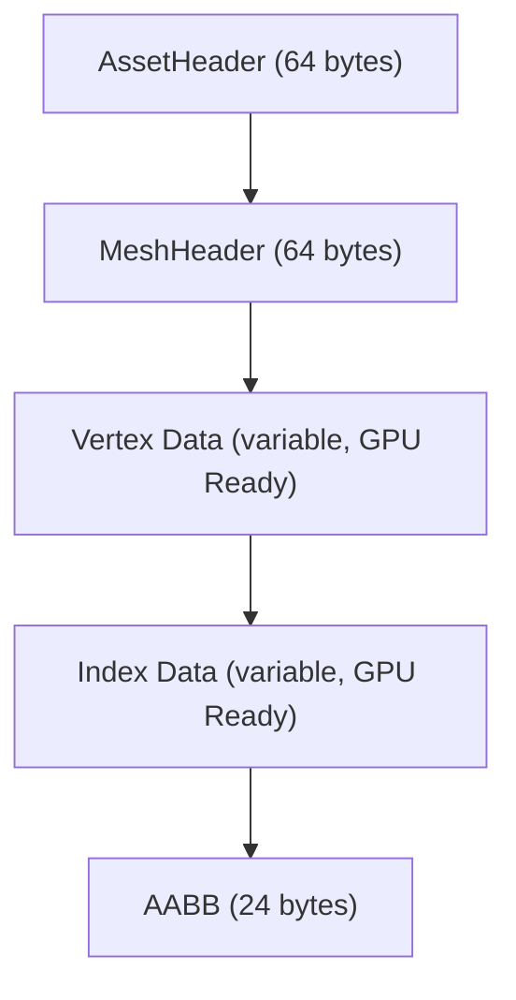

Dans mon précédent article, on a parlé de l'orchestre (le Frame Graph). Mais un orchestre sans partitions, c'est juste une bande de gens avec des instruments brillants qui se regardent dans le blanc des yeux. Dans i3, ces partitions, ce sont nos **assets** (mesh, scènes, squelettes, animations). Et leur préparation est tout sauf triviale.

Si tu penses qu'un moteur 3D moderne charge directement un fichier `.obj` ou `.gltf` au runtime, c'est le meilleur moyen de plomber littéralement tes performances et d'exploser tes temps de chargement. Ces formats sont faits pour être échangés entre humains et outils de modélisation (Blender, Maya), pas pour être digérés par un GPU affamé. 

### Le Pacte du Zéro Copie

Pour i3, j'ai passé un pacte avec moi-même : le **Zéro Copie**. L'idée est d'une brutalité absolue : une fois que l'asset est sur le disque, il doit pouvoir être "mappé" directement en mémoire virtuelle via un appel système `mmap`, et ses sous-sections doivent pouvoir être injectées dans des buffers Vulkan sans *aucune* transformation résidente sur le processeur. Pas de parsing JSON au vol, pas de réalignement de mémoire, pas de swizzle de vecteurs. Du silicium pur, direct.

C'est là qu'entre en scène le **Baker** (`i3_baker`). Contrairement à ce qu'on pourrait penser, ce n'est pas un outil CLI offline manuel. Pour l'instant, il est invoqué directement depuis le `build.rs`. L'idée est de coupler le processus : la génération du binaire entraîne la compilation incrémentale des assets en *bundles* `.i3b` et catalogues `.i3c`.

### Importer vs Extractor : L'architecture dédoublée

L'architecture du baker repose sur une séparation stricte entre le **parsing** et la **conversion**, via deux couches distinctes : les **Importers** et les **Extractors**.

D'un côté, l'**Importer** lit le format source et produit une représentation intermédiaire en mémoire. Pour la géométrie, j'utilise une intégration C++ native de **Assimp** (via le binding `russimp`). Assimp parse un fichier source complexe (`.glb`, `.fbx`) **une seule et unique fois**, générant une arborescence de scène unifiée.

De l'autre, les **Extractors** consomment cette représentation intermédiaire pour générer les blobs binaires finaux. 
Le point critique en termes d'architecture, c'est qu'un seul import déclenche de multiples extractions. Pour un personnage complet :
- Le `MeshExtractor` va itérer sur les primitives (`aiMesh`) et générer des géométries `.i3mesh`.
- Le `SceneExtractor` va traverser le graphe de scène (MeshRefs, transform matrices accumulées) et l'aplatir en instanciation `.i3scene`.
- Le `SkeletonExtractor` va construire la hiérarchie des joints (`i16` parent indices) et les matrices d'inverse bind en `.i3skeleton`.
- L'`AnimationExtractor` convertira les frames en un pool de valeurs continu `.i3animation`.

### La cuisine interne : .i3mesh et layout mémoire

Jetons un œil sous le capot d'un asset compilé, par exemple `.i3mesh`. Pour garantir le Zéro Copie, le fichier est organisé avec des structures explicitement taggées `repr(C)`.

Le struct `MeshHeader` stocke exactement ce que l'API Vulkan a besoin de savoir :
- `vertex_count` et `index_count`.
- `vertex_stride` et `vertex_format` (un enum pointant vers le layout mémoire exact. Par exemple, le format `PositionNormalUvSkinned` pèse rigoureusement 52 octets par vertex).
- Les offsets (`u32`) absolus depuis le début du blob vers les données vertex et index (`vertex_offset`, `index_offset`).

Pour le skinning, l'alignement est au cordeau :
- `joints` : `[u8; 4]` (permettant 256 os par squelette, garantissant un poids minimal tout en couvrant l'écrasante majorité des cas).
- `weights` : `[f32; 4]` (stocké explicitement, même le 4ème poids, pour éviter de le recalculer via `w4 = 1.0 - w1 - w2 - w3` dans le vertex shader).

Au runtime (via le crate de l'engine `i3_io`), le composant VFS fait son `mmap`, cast une vue de la mémoire en structure `MeshHeader`, et utilise les pointeurs pré-calculés par l'offseting pour populer immédiatement la structure de création du `VkBuffer`. C'est de l'injection directe.

### Le concept d'état global : .i3pipeline

Cette philosophie Zéro Copie ne s'applique pas qu'à la géométrie. La réflexion s'étend à un concept majeur : l'asset `.i3pipeline`.

Historiquement (et c'est une horreur dans Vulkan/DX12), lier des shaders et de l'état fixe de rastérisation (Blend, DepthStencil, InputAssembly) à l'exécution prend un temps fou. Dans le pipeline du Baker, l'objectif n'est pas de compiler un simple shader SPIR-V isolément. 

A la place, le Baker prendra un fichier de shading haut-niveau (via le `SlangImporter`) et produira un asset complet contenant :
- Les bytecodes SPIR-V de tous les entry-points concaténés.
- Un bloc sérialisé représentant l'intégralité du `VkGraphicsPipelineCreateInfo` (RasterizationState, cibles de rendus, modes de blending).
Résultat : à l'exécution, le renderer dépile simplement le blob et construit son Pipeline Object d'un seul jet.

### Rayon et la saturation CPU

L'autre immense impact de cette architecture fortement découplée, c'est la parallélisation. Baker est un outil conçu pour être agressif. Lors d'un "bake", il va scanner le dossier d'assets source et croiser méticuleusement les dates de modification (`mtime`) avec les entrées du catalogue `.i3c`.

Il identifie ainsi le delta des fichiers à rebaker et envoie le tout dans un pool de threads géré par **Rayon**. Comme chaque asset source est totalement décorrélé des autres, le Baker sature instantanément l'ensemble des cœurs physiques du processeur :
1. Chaque thread charge un fichier source en parallèle.
2. L'Importer parse les données dans la structure mémoire intermédiaire.
3. Les Extractors génèrent les blobs (souvent eux-mêmes capables de s'exécuter en parallèle).
4. Un `BundleWriter` thread-safe, blindé aux conditions de course, concatène les blocs finaux dans le ficher bundle `.i3b` lourd.

Même avec des centaines d'assets complexes, un "rebake" incrémental ne prend que quelques dizaines de millisecondes. Fini les pauses café imposées de 20 minutes pendant la compilation du niveau.

### Conclusion

Le pipeline d'assets est souvent relégué au second plan, traité comme un vulgaire script Python annexe. Pourtant, en déportant intégralement la complexité algorithmique, les redressements mathématiques (winding order, layouting lourd, calcul des AABB) et les analyses topologiques complexes EN OFFLINE, on libère totalement le runtime de ces frictions.

C'est cette obsession de l'architecture "direct-to-metal" qui définit i3. Le moteur ne gaspille pas un seul cycle d'horloge à "charger" des données, il se contente d'y mapper le GPU. Dans une architecture exigeante, la bataille se gagne avant même l'exécution.
