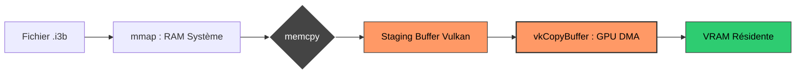

L'idée de faire un moteur de rendu, c'est un peu un engrenage sans fin : à la première scène, tu fais un `draw_triangle` et déjà, avec une API comme Vulkan, ça t'occupe un bon moment. Ensuite tu te dis que le cube c'est bien, tu vas pouvoir tester tes matrices et tes UBOs. 

Mais au bout d'un moment, l'ambition te rattrape. Tu veux faire du **GPU Driven**, du **Hi-Z Occlusion Culling**, du **Ray Tracing**, du **ReSTIR**... et là, les cubes, c'est bien mais c'est vite limité. "Ah oui les mecs, j'ai une super démo avec du GPU Driven, de la GI, du RT et tout ! 🚀"... et là tu montres une Cornell Box. Forcément, t'auras pas l'effet "Wahou". Il te faut de **vraies scènes complexes**, et c'est précisément pour ça que j'ai commencé le système de **baking d'assets** d'**[i3](https://github.com/doomtr666/i3)** assez tôt. 

Plus sérieusement, c'est aussi le seul vrai moyen de tester la **robustesse** de l'engine. Bim, une petite normale dégénérée, et c'est un **NaN** qui vient faire exploser ton shader de lighting. Chaque nouvel asset apporte son lot de problèmes imprévus. C'est un processus itératif qui s'inscrit dans le temps : on raffine le Baker au fur et à mesure que les scènes deviennent plus gourmandes.

### Le Duo Dynamique : i3_baker vs i3_io

L'architecture d'i3 repose sur une séparation drastique des responsabilités via deux crates distinctes :

1.  **`i3_baker` (Le Poids Lourd)** : C'est l'outil de build. C'est lui qui "se prend toutes les calamités". Il dépend de **Assimp** (pour la 3D), **Slang** (pour les shaders), **Image** (pour les textures), et **Rayon** (pour paralléliser tout ça). Pour les textures, il intègre **Intel ISPC Texture Compressor** (`intel-tex-2`) pour une compression BCn (BC1 à BC7) de haute qualité, avec un **fast-path** dédié si l'asset est déjà au format DDS (via `ddsfile`). C'est un monstre de plusieurs Mo qui ne sert qu'au développement.
2.  **`i3_io` (La Formule 1)** : C'est le runtime. Il est ultra-lean. Ses seules dépendances ? `memmap2` pour le mapping binaire, `bytemuck` pour le casting, et surtout **`rayon`** pour paralléliser le chargement asynchrone des assets via son thread pool global. C'est la seule crate qui termine dans ton binaire de jeu.

Le secret ? `i3_io` définit le **Contrat Binaire** (les headers). Le Baker doit s'y plier. Au runtime, le moteur ne sait même pas qu'Assimp existe ; il ne voit que des octets alignés parfaitement.

### Le Pacte du Zéro Copie (et ses petits caractères)

Pour i3, j'ai passé un pacte avec moi-même : le **Zéro Copie**. Mais attention, ce n'est pas une formule magique gratuite. Pour les données CPU (métadonnées, headers), on a bien un accès direct sans copie via `mmap`. Pour le GPU, c'est une autre paire de manches.

L'idée, c'est de préparer le terrain pour que le transfert vers Vulkan soit le plus fulgurant possible. Et pour ça, on paie deux taxes :

1.  **La taxe d'alignement (4 Ko / 64 Ko)** : Chaque asset dans le bundle est aligné sur **64 Ko**. Oui, ça crée de la fragmentation et ton fichier `.i3b` est plus gras, mais c'est le prix pour optimiser les transferts. Un tel alignement est la voie royale vers **`VK_EXT_external_memory_host`**—plutôt qu'un DirectStorage complet et douloureux—pour allouer un staging buffer directement sur l'adresse mmapée et squeizzer les copies inutiles à l'avenir.
2.  **L'absence d'abstraction** : On caste le pointeur mémoire directement en structure Rust via `bytemuck`. Zéro parsing. Cela implique, par exemple, que le bundle est dans l'**endianness natif** : le build est donc spécifique à chaque plateforme.

### Le Dogme du Zéro Copie vs La Réalité du Silicium

On parle souvent du **Zéro Copie** comme du Graal : tu `mmap` ton fichier, tu donnes l'adresse à Vulkan et hop, la magie opère. Mais attention aux raccourcis : même avec le **Resizable BAR** activé, on ne se contente pas de "mapper" le SSD dans la VRAM en espérant que ça brille. La physique du bus PCIe impose ses règles.

Exposer la mémoire *Device Local* du GPU dans l'espace d'adressage du CPU (via le BAR), c'est donner une adresse de livraison, pas embaucher un déménageur. Si vous laissez votre CPU faire un `memcpy` vers cette zone, vous allez saturer vos cœurs pour un débit ridicule. Le CPU n'est pas fait pour pousser des octets sur un bus à haute latence comme le PCIe.

#### Le Staging : Un échec ? Pas si vite.

Dans **i3**, le "Pacte du Zéro Copie" s'appuie sur la seule force brute capable de saturer le bus : le **Copy Engine (DMA)** du GPU. Actuellement, notre pipeline ressemble à ça :

1.  **Le Terrain Neutre (RAM)** : L'OS utilise le DMA du contrôleur NVMe pour remplir les pages de la RAM système depuis le SSD. C'est le job historique et ultra-optimisé du noyau via `mmap`.
2.  **Le Transfert "Burst"** : C'est là que la magie opère. Lors du `vkCmdCopyBufferToImage`, on réveille le **Copy Engine** de la RTX. C'est lui, et lui seul, qui prend les commandes du bus PCIe. Il "aspire" les données depuis la RAM par rafales massives (32 Go/s en PCIe 4.0, 64 Go/s en 5.0) pour les injecter en VRAM.
3.  **Le "Petit" Memcpy** : Et c'est là que j'ai menti. Oui, il y a un `memcpy` entre l'étape 1 et 2. Le lecteur le plus attentif verra tout de suite la contradiction : comment peut-on parler de **Zéro Copie** en faisant un `memcpy` ? 



#### Le Mirage DirectStorage

On pourrait citer **[DirectStorage](https://devblogs.microsoft.com/directx/category/directstorage/)** de Microsoft comme la solution miracle. C'est une techno proprio "magique" qui promet de régler tous nos problèmes de streaming. Mais pour i3, c'est un non-sens total. 

D'abord, c'est une techno taillée pour les consoles Microsoft et leur archi fermée. Pour un moteur basé sur Vulkan, intégrer DirectStorage sous Windows demande un niveau de masochisme architectural assez élevé (interop DX12/Vulkan, gestion des files d'attente croisées...). Et surtout, ça ne solutionne absolument rien pour le monde **Linux**. 

Sans parler de la **HRI** (Hardware Rendering Interface) : essayer de faire un découplage propre entre le chargement optimisé et le backend de rendu avec une API pareille, c'est s'assurer une migraine permanente. On évite aussi pour l'instant la complexité du **GDeflate** : même si l'idée de tester la lib open-source de NVIDIA pour compresser de la géométrie (meilleure entropie !) me trotte dans la tête, le gain réel reste à prouver. En restant sur du **BC7** pour les textures, on a déjà du natif que le GPU prend sans réfléchir.

#### VK_EXT_external_memory_host : La solution des gens raisonnables

Alors, qu'est-ce qu'on fait ? C'est là que [**`VK_EXT_external_memory_host`**](https://registry.khronos.org/vulkan/specs/1.3-extensions/man/html/VK_EXT_external_memory_host.html) entre en scène. C'est le "sweet spot" ultime. 

Techniquement, c'est juste un test de support d'extension et un petit `if` : soit un "allocate staging / memcpy", soit juste "EMH + binding du staging". Si l'extension n'est pas supportée, tant pis. Sinon, on gagne un peu sur le temps de transfert et la pression CPU. 

On notera d'ailleurs que même sans cette optimisation, le pipeline actuel d'i3 n'est "pas si mal" : le chargement complet d'une scène comme **Bistro (Exterior)** prend environ **1 seconde** sur du hardware moderne. 


### Anatomie d'un Bundle : Le frigo et son sommaire

Pour éviter d'ouvrir 4000 fichiers, i3 regroupe tout dans deux fichiers :

1.  **Le Bundle (`.i3b`)** : Le frigo géant. Une suite de blobs binaires alignés sur 64 Ko.
2.  **Le Catalogue (`.i3c`)** : Le post-it sur la porte. Il nous dit où est rangée la ressource (l'offset) et sa taille.

Chaque asset dans le bundle commence par un **AssetHeader** fixe de 64 octets (défini dans `i3_io`) :

```rust
#[repr(C)]
pub struct AssetHeader {
    pub magic: u64,             // 0..8   0x4933415353455400 ("I3ASSET\0")
    pub version: u32,           // 8..12  Version: 1
    pub compression: u32,       // 12..16 0: None, 1: Zstd...
    pub data_offset: u64,       // 16..24 Offset absolu dans le .i3b
    pub data_size: u64,         // 24..32 Taille compressée
    pub uncompressed_size: u64, // 32..40
    pub asset_type: [u8; 16],   // 40..56 UUID du type (Mesh, Texture...)
    pub _reserved: [u8; 8],     // 56..64 Padding pour l'alignement
}
```

Le catalogue est une simple liste de **CatalogEntry** (128 octets). Au runtime, `i3_io` fait son `mmap`, caste la mémoire en tableau de structures, et paf : accès O(1) à n'importe quel asset par son UUID.

### La Boucherie : Extraction et mise en boîte

Le **Baker** (`i3_baker`) est le boucher. Il prend la bête (un `.gltf` via **Assimp**) et la découpe en morceaux choisis par les **Extractors**. 

#### 1. Meshes : Alignement au scalpel
Un mesh dans i3 (`.i3mesh`), c'est un **MeshHeader** suivi des données vertex et index brutes.

```rust
#[repr(C)]
pub struct MeshHeader {
    pub vertex_count: u32,
    pub index_count: u32,
    pub vertex_stride: u32,
    pub index_format: IndexFormat, // u16 ou u32
    pub vertex_format: VertexFormat,
    pub vertex_offset: u32, // Offset relatif vers les données vertex
    pub index_offset: u32,  // Offset relatif vers les données index
    pub bounds_offset: u32, // Offset vers la Bounding Box (AABB)
    pub skeleton_id: [u8; 16],
    pub material_id: [u8; 16],
}
```
L'extracteur calcule le **VertexFormat** idéal. Si tu as des UVs et des Tangents, tu tombes sur un stride de 48 octets. Le renderer n'aura qu'à mapper son `VkBuffer` sur l'offset pré-calculé. Rideau.

#### 2. Pipelines : Une base de travail stable
Un **.i3pipeline** contient tout pour créer un `VkPipeline` en un seul appel. L'idée ici n'est pas encore de révolutionner le shading, mais d'avoir une **base de travail stable** au niveau du trait backend pour commencer à bosser sérieusement. 

On sérialise l'état fixe (Blend, DepthStencil, Rasterization) en offline via `i3_baker`, on y colle le bytecode SPIR-V, et on y injecte la **reflection shader**. Cette dernière est cruciale pour le moteur : elle permet de créer dynamiquement les layouts (Descriptor & Pipeline) sans que le développeur n'ait à tout se taper à la main. Au runtime, `i3_io` n'a plus qu'à **caster** la structure pour que le renderer appelle `vkCreateGraphicsPipelines`. 

La vraie target, c'est le futur **DSL de shading i3**, qui apportera une vraie abstraction au niveau shader, mais c'est un gros chantier que j'ai mis en priorité "plus tard".

### build.rs et Rayon

Le Baker est intégré au cycle de compilation Rust via le `build.rs` de ton application. Grâce à `cargo:rerun-if-changed`, le Baker ne s'active que si un fichier source a bougé. Et comme il utilise **Rayon**, il sature tous tes cœurs CPU pour transformer des centaines de textures et meshes en millisecondes. 

### Conclusion : Bootstrap completed

Si tu ouvres la crate `i3_io` maintenant, tu devrais t'y sentir chez toi. Les headers de 64 octets alignés, les castings `bytemuck` et cette obsession pour le Zéro Copie sont les fondations de i3. Le Baker n'est pas juste un compilateur d'assets ; c'est lui qui gagne la bataille de la performance avant même que le premier frame ne soit rendu. 

Dans le prochain article, on verra comment on remonte tout ça pour faire de la 3D, pour de vrai.

