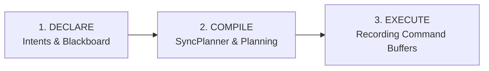

Dans mon [article précédent](../about-i3/), je vous parlais du fameux "renoncement" : le passage au **Frame Graph** pour mon moteur **[i3](https://github.com/doomtr666/i3)**. C'est un grand mot, un peu à la mode dans le milieu du moteur 3D, mais derrière le buzzword se cache une réalité brutale. Quand tu passes sur des API explicites comme Vulkan, tu te retrouves avec la gestion manuelle des barrières de synchronisation. Et là, c'est le début des emmerdes.
<!--more-->

Le problème, c'est que nos GPU modernes sont des machines massivement parallèles. Par défaut, ils tentent d'exécuter un maximum d'opérations simultanément. Sauf que dans un algorithme de rendu, tout n'est pas parallélisable : le *Lighting* a besoin du *GBuffer*, le *Post-process* a besoin de la scène éclairée, et ainsi de suite.

Gérer la synchronisation manuellement avec des barrières, c'est l'art complexe de restreindre ce parallélisme pour garantir la cohérence des données. Multiplie ça par une centaine de passes de rendu et des milliers de ressources, et tu as une recette parfaite pour des bugs de synchronisation indémerdables (glitchs visuels, artefacts graphiques, etc.) ou des pertes de performances massives si tes barrières sont trop conservatrices.

### Le problème du couplage implicite

Le vrai souci, c'est le couplage. Pour poser une barrière Vulkan cohérente, tu es obligé de définir deux choses : l'utilisation **cible** de la ressource (ce que ta passe actuelle va en faire), mais aussi son utilisation **précédente** (ce que la passe d'avant a fait).

C'est là que le piège se referme. Si ta passe de *Lighting* a besoin de savoir exactement dans quel état la passe de *GBuffer* a laissé la texture de profondeur pour poser sa barrière, et que tu veux rajouter une passe de *Decals* au milieu ? Vas-y, bon courage pour aller modifier manuellement toutes les barrières de la chaîne pour refléter le nouvel état "avant".

C'est là qu'on prend la mesure du terme « explicite » dans l'API Vulkan. Rien n'est gratuit. C'est un modèle verbeux, punitif, et passer ses journées à spécifier des barrières à la main est le meilleur moyen de finir avec un code aussi souple qu'une poutre en béton armé.

Pour préserver un semblant de santé mentale et de flexibilité, l'abstraction n'est plus une option.

### Le Modèle de Synchronisation Vulkan

Pour comprendre pourquoi le Frame Graph est vital, il faut revenir aux bases. Vulkan repose sur un modèle de synchronisation explicite orchestrant quatre acteurs principaux :

1.  **Queues** : Unités d'exécution matérielles (Graphics, Async Compute, Transfer/DMA).
2.  **Command Buffers** : Listes d'instructions soumises aux queues.
3.  **Barrières** : Synchronisation *intra-queue* (cohérence mémoire entre les commandes d'une même queue).
4.  **Sémaphores** : Synchronisation *inter-queues* (ordonnancement entre différentes unités d'exécution).

Gérer la synchronisation en Vulkan, c'est jongler entre deux types de dépendances selon la spécification [Synchronization 2](https://registry.khronos.org/vulkan/specs/1.3-extensions/man/html/VK_KHR_synchronization2.html) :

-   **Execution Dependency (Sémaphores)** : C'est la garantie qu'un ensemble d'opérations se termine avant qu'un autre ne commence. C'est le "quand". On utilise principalement les **Sémaphores** pour synchroniser les différentes queues du GPU entre elles.
-   **Memory Dependency (Barrières)** : C'est la garantie que les accès mémoire (écritures) d'un premier groupe d'opérations sont rendus **disponibles** et **visibles** pour un second groupe. C'est le "quoi". C'est le rôle des **Barrières** à l'intérieur d'une même queue.

En clair : tu peux très bien utiliser un sémaphore pour attendre que le GPU ait fini d'écrire (dépendance d'exécution), sans pour autant que la donnée soit "lisible" par le cache du shader suivant (dépendance de mémoire). C'est le piège classique où ton image est prête, mais le GPU essaie de la lire à travers un cache périmé. Glitch garanti.

#### Le Multi-Queue
 
Le hardware moderne ne se résume plus à une seule unité de calcul. Il dispose de plusieurs **Queues** indépendantes : de l'**Async Compute** pour paralléliser des tâches lourdes (Culling, Denoising), des **DMA Copy Engines** pour le streaming d'assets en tâche de fond, et même des moteurs d'encodage vidéo dédiés. L'intérêt majeur est le **recouvrement (overlap)**. Si ta queue Graphics ne sature pas toutes les unités de calcul du GPU (problème d'**occupancy**), l'Async Compute permet de "combler les trous" pour exploiter 100% du silicium. De même, les DMA Copy Engines permettent d'injecter des textures en VRAM sans jamais perturber la fluidité de tes appels de draw.
 
 L'ordonnancement de cette chorégraphie se fait via des **Sémaphores**. Dans i3, mon choix s'est porté sur les **Timeline Semaphores** (Vulkan 1.2+). Contrairement aux sémaphores binaires classiques, elles permettent de suivre la progression du GPU via un simple compteur monotone, ce qui est bien plus élégant pour piloter un graphe de rendu complexe.
 
 -   **Queue A (Graphics)** : Signale la valeur 10 quand le rendu est prêt.
 -   **Queue B (Compute)** : Attend que la valeur 10 soit atteinte avant de commencer.

#### CONCURRENT vs EXCLUSIVE

Quand une ressource est partagée entre plusieurs queues, Vulkan propose deux modes :

-   **CONCURRENT** : Plusieurs queues peuvent accéder à la ressource simultanément. C'est simple car une barrière classique suffit. Sur i3, c'est le mode privilégié pour les **buffers** (VBO/IBO/UBO) car ils ne bénéficient pas d'optimisations de layout complexes.
-   **EXCLUSIVE** : La ressource appartient à une seule queue à la fois. C'est le mode par défaut pour les **images** sur i3. Pourquoi se faire chier avec ça ? Parce qu'en mode `CONCURRENT`, le driver doit garantir une représentation mémoire compatible avec toutes les queues. Cela désactive d'office la **DCC (Delta Color Compression)**, particulièrement chez AMD. En restant en `EXCLUSIVE`, on laisse au matériel la liberté de compresser ses données comme il l'entend, au prix d'une gestion de transfert de propriété un peu plus velue.

#### Ownership Transfer et Layout Transitions

Le revers de la médaille du mode `EXCLUSIVE`, c'est qu'il faut orchestrer un **Ownership Transfer** : une opération en deux temps composée d'une barrière de **Release** sur la queue source et d'une barrière d'**Acquire** sur la queue cible, synchronisées par un **sémaphore** pour ordonnancer les queues matérielles. 

À cela s'ajoutent les **Layout Transitions**. Les constructeurs ont la liberté de changer la représentation mémoire interne des images lors d'une barrière pour optimiser leur accès (ex: passage d'un layout "écriture" à un layout "lecture shader" optimisé pour le cache).

```c
// Exemple : transition d'usage, de layout et de queue
VkImageMemoryBarrier2 image_barrier = {
    .sType = VK_STRUCTURE_TYPE_IMAGE_MEMORY_BARRIER_2,
    .srcStageMask  = VK_PIPELINE_STAGE_2_COLOR_ATTACHMENT_OUTPUT_BIT,
    .srcAccessMask = VK_ACCESS_2_COLOR_ATTACHMENT_WRITE_BIT,
    .dstStageMask  = VK_PIPELINE_STAGE_2_COMPUTE_SHADER_BIT,
    .dstAccessMask = VK_ACCESS_2_SHADER_READ_BIT,
    .oldLayout     = VK_IMAGE_LAYOUT_COLOR_ATTACHMENT_OPTIMAL,
    .newLayout     = VK_IMAGE_LAYOUT_SHADER_READ_ONLY_OPTIMAL,
    .srcQueueFamilyIndex = graphics_queue_idx,
    .dstQueueFamilyIndex = compute_queue_idx,
    .image         = my_texture,
    .subresourceRange = { VK_IMAGE_ASPECT_COLOR_BIT, 0, 1, 0, 1 }
};
```

Ici, je définis le passage d'une écriture (Color Attachment) à une lecture shader (Compute Shader), un changement de layout mémoire optimal pour le cache, et un transfert de propriété entre la queue Graphics et la queue Compute.
 
Le lecteur averti remarquera qu'il ne s'agit ici que d'une **« demi-barrière »** de Release : elle doit impérativement avoir son pendant (**Acquire**) sur la queue de destination pour être valide. Cet exemple fait également l'impasse sur la synchronisation par **Sémaphore**, indispensable pour que la queue cible n'essaie pas d'acquérir la ressource avant que la source ne l'ait relâchée. Enfin, la présence du **subresourceRange** rappelle que ces transitions peuvent s'opérer finement au niveau du mip-level ou de l'array-layer, ce qui démultiplie encore la complexité de gestion.
 
Cette accumulation de contraintes — Release/Acquire, Layout Transitions, Sémaphores — expose la réalité brute de Vulkan : c'est un pur **nid à emmerdes**. C'est verbeux, c'est fragile au moindre refactoring, et c'est statistiquement garanti que vous avez oublié une barrière quelque part.

Ces trois propriétés — complexité, verbosité, fragilité — rendraient n'importe quel moteur de rendu qui expliciterait manuellement ses barrières extrêmement **RIGIDE**.

La moindre modification devient un risque. Le couplage ne suit pas l'ordre linéaire du code mais le **flux de données** du graphe : changer une passe modifie l'état d'une ressource, ce qui impacte par ricochet toutes ses passes consommatrices, parfois bien plus loin dans la frame.

Certaines approches que j'ai testées (comme [V-EZ](../about-i3/)) tentent de résoudre ça en masquant tout sous le tapis. Le problème, c'est que ça revient à coder un **pseudo-driver OpenGL** moisi. On perd le contrôle sur les optimisations fines du matériel, ce qui est précisément la raison pour laquelle on a choisi Vulkan au départ. C'est ce constat d'échec qui m'a poussé à pivoter vers une architecture de Frame Graph.

Inspiré par les travaux de [DICE sur Frostbite](https://www.ea.com/frostbite/news/framegraph-extensible-rendering-architecture-in-frostbite), le Frame Graph d'i3 traite le rendu comme un problème de compilation.

### L'Architecture du frame graph d'i3

Pour comprendre le code de i3, il faut voir son Frame Graph non pas comme un simple gestionnaire de barrières, mais comme un véritable compilateur de frame. Son rôle est de transformer une intention de haut niveau en un flot de commandes matérielles optimales.



#### 1. Design Agnostique
Le Frame Graph d'i3 est **totalement agnostique**. Il ne manipule ni `VkImage`, ni `VkBuffer`, et n'a aucune connaissance de l'API Vulkan. Il travaille sur une couche d'abstraction pure à la frontière de l'**HRI (Hardware Rendering Interface)** :
- **Symboles** : Des identifiants typés représentant les ressources logiques.
- **Intents** : Des intentions d'usage (Lecture Fragment Shader, Écriture Color Attachment, etc.).
Le graphe compile ces intentions pour générer un plan de synchronisation logique, laissant au backend la responsabilité de matérialiser cela en primitives matérielles (`VkImageMemoryBarrier2`).

#### 2. Publish / Consume : Le Contrat de Données
Pour éviter les pièges du "Blackboard" global (souvent source de couplage occulte et difficile à debugger), i3 s'appuie sur une **Scoped Symbol Table**. La séparation est nette entre les deux moments de vie d'une passe :

**Phase de DECLARE (Déclaration des intentions)**
C'est ici que tout se joue pour le compilateur de frame. La passe ne manipule aucun buffer de commande matériel. Elle exprime ses besoins de deux manières :
- **Intents sur les ressources** : Via `builder.write_image` ou `builder.read_buffer`. Ces déclarations permettent au **SyncPlanner** de simuler l'état théorique du GPU et de préparer les barrières.
- **Accès au Scoped Blackboard** : Via `builder.consume::<T>` pour récupérer une donnée (ex: la position du soleil) ou `builder.publish::<T>` pour en produire une destinée aux passes suivantes.

**Phase de EXECUTE (Enregistrement des commandes)**
Une fois le planning établi et compilé, le moteur appelle `execute`. C'est seulement à ce stade que la passe accède au **Command Buffer** matériel. Grâce au travail fait en amont, la passe enregistre ses appels de draw/dispatch en toute sécurité : les barrières nécessaires ont déjà été injectées entre les appels par le moteur selon le plan établi par le SyncPlanner.

#### 3. Hiérarchie récursive (NodeTree)
Le graphe est structuré comme un arbre récursif composé de deux types de nœuds :
- **Leaf (Pass)** : Une unité atomique enregistrant une séquence ininterruptible de commandes GPU.
- **Branch (Group)** : Un conteneur de nœuds gérant un scope local de symboles.
Cette hiérarchie est la clé de l'**extensibilité** du moteur : on peut injecter une passe de rendu optionnelle dans le groupe "GBuffer" sans jamais avoir à modifier le code des passes de "Lighting", le compilateur résolvant dynamiquement les dépendances entre les branches.

#### 4. Parallélisme natif
L'enregistrement des commandes (phase EXECUTE) est conçu pour saturer le CPU sans aucun goulot d'étranglement :
- **Fork-Join ([Rayon](https://github.com/rayon-rs/rayon))** : Le compilateur identifie les groupes de passes indépendantes et les distribue sur un pool de threads via un modèle de *work-stealing*.
- **Thread-local Command Pools** : Chaque thread worker possède son propre pool de commandes matérielles (`VkCommandPool`) par frame. L'enregistrement est donc **100% parallèle**, sans aucun mutex ni contention atomique sur les ressources de l'API graphique.
- **Parallel Recording** : Pour les passes massives (ex: GBuffer avec des milliers d'objets), i3 permet de "forker" l'enregistrement intra-passe via des **Secondary Command Buffers**.

#### 5. Le SyncPlanner
Le **SyncPlanner** est le cerveau logistique du système. Il simule le déroulement de la frame pour maintenir l'état de chaque symbole (layout, access flags, queue). En comparant l'état requis par une passe avec l'état laissé par la précédente, il génère un **SyncPlan** — une suite d'instructions de synchronisation abstraites — que le backend concrétise ensuite en barrières Synchronization2.

### Exemple Pratique : La SkyPass d'i3

Rien ne vaut un exemple concret tiré du code source (`sky.rs`) pour illustrer comment ces concepts s'articulent dans la réalité. Voici une version simplifiée de la passe de rendu du ciel dans i3 :

```rust
impl RenderPass for SkyPass {
    fn name(&self) -> &str { "SkyPass" }

    // Phase d'initialisation (appelée une seule fois au boot)
    fn init(&mut self, backend: &mut dyn RenderBackend, globals: &mut PassBuilder) {
        // On consomme le service de chargement d'assets depuis le scope Global
        let loader = globals.consume::<Arc<AssetLoader>>("AssetLoader");
        
        // Chargement du shader "sky" et création de la pipeline matérielle
        if let Ok(asset) = loader.load::<PipelineAsset>("sky").wait_loaded() {
            self.pipeline = Some(backend.create_graphics_pipeline(asset));
        }
    }

    // Phase de DECLARE (appelée à chaque frame)
    fn declare(&mut self, builder: &mut PassBuilder) {
        // 1. Résolution des identifiants d'images sur le Blackboard
        let hdr_target = builder.resolve_image("HDR_Target");
        let depth_buffer = builder.resolve_image("DepthBuffer");

        // 2. Consommation des données CPU (Caméra, Soleil) publiées par d'autres systèmes
        let common = builder.consume::<CommonData>("Common");
        let sun_dir = builder.consume::<glm::Vec3>("SunDirection");

        // 3. Déclaration formelle du contrat d'usage (Intents)
        // Le SyncPlanner utilisera ces infos pour générer les barrières optimales.
        builder.write_image(hdr_target, ResourceUsage::COLOR_ATTACHMENT);
        builder.read_image(depth_buffer, ResourceUsage::DEPTH_STENCIL);
    }

    // Phase d'EXECUTE (Enregistrement parallèle des commandes GPU)
    fn execute(&self, ctx: &mut dyn PassContext) {
        let pipeline = self.pipeline.as_ref().expect("Pipeline non initialisée");
        
        ctx.bind_pipeline(pipeline);
        ctx.push_constants(self.current_frame_data);
        ctx.draw(3, 0); // Rendu d'un triangle plein écran pour le ciel procédural
    }
}
```

#### Ce qu'il faut retenir :
-   **Zéro Barrière** : Le développeur n'appelle jamais `vkCmdPipelineBarrier`. C'est le fait d'appeler `builder.write_image` dans la phase `DECLARE` qui donne au SyncPlanner l'information nécessaire pour injecter la transition au moment opportun.
-   **Découplage Total** : La `SkyPass` ne sait pas qui a créé la texture `HDR_Target`, ni dans quel état elle se trouve. Elle exprime un besoin, et le moteur garantit que ce besoin est satisfait.
-   **Typage Fort** : La consommation des données (`consume::<CommonData>`) est sécurisée par le système de type de Rust, éliminant toute une classe de bugs liés à la gestion d'états globaux mal typés.

### Composition et Hiérarchie : Le PostProcessGroup
La structure d'i3 est récursive. Une passe peut être une feuille (Pass) ou une branche (Group). Cela permet de packager des features entières (Post-Process, UI, GBuffer) dans des modules indépendants :

```rust
pub struct PostProcessGroup {
    pub histogram_pass: HistogramBuildPass,
    pub tonemap_pass: TonemapPass,
}

impl RenderPass for PostProcessGroup {
    fn name(&self) -> &str { "PostProcessGroup" }

    fn declare(&mut self, builder: &mut PassBuilder) {
        // Un groupe ne fait pas de rendu direct, il organise le sous-graphe.
        // On peut ainsi isoler toute une feature (ex: Post-Process ou UI)
        // dans un module indépendant et réutilisable.
        builder.add_pass(&mut self.histogram_pass);
        builder.add_pass(&mut self.tonemap_pass);
    }
    
    // Le groupe ne possède pas de phase execute() propre ; 
    // ce sont les passes feuilles ajoutées qui l'implémentent.
}
```

### Les Types de Ressources : Transientes, Externes et Persistantes
Pour le développeur d'i3, toutes les ressources sont des **Symboles**, mais leur Cycle de Vie (Lifetime) définit comment elles sont gérées en mémoire :

- **Ressources Transientes** : Créées et détruites au sein d'une même frame (ex: GBuffer, ombres intermédiaires). Puisque leur durée de vie est courte et connue, elles sont les candidates parfaites pour l'**Aliasing mémoire** : le moteur peut réutiliser le même bloc de VRAM pour deux textures transientes dont les usages ne se chevauchent pas dans le temps.
- **Ressources Externes** : Ressources gérées en dehors du Frame Graph (assets, textures de matériaux, meshes). On les "bind" dynamiquement au moteur pour que le SyncPlanner puisse inclure leurs accès dans son plan global, mais le graphe n'en assume pas la propriété.
- **Ressources Persistantes (ou Temporelles)** : Ressources créées par le graphe qui doivent survivre d'une frame à l'autre. C'est ici qu'interviennent les fonctionnalités d'historique.

### Symboles Temporels : La gestion de l'Historique
Dans un moteur moderne, beaucoup d'algorithmes ont besoin d'accéder au résultat de la frame précédente. Dans i3, c'est par exemple le cas de la passe de **Tonemapping** qui utilise l'historique de luminance pour assurer une adaptation d'exposition fluide.

i3 résout ce problème nativement via les **Symboles Temporels** :
- **History Depth** : Lors de la déclaration d'un symbole sur le Blackboard, on peut lui spécifier une profondeur d'historique (ex: `depth: 1` pour conserver le résultat N-1).
- **Ring Buffering Transparent** : Le moteur gère en interne un registre circulaire de ressources physiques. L'utilisateur n'a jamais à manipuler d'index de buffer.
- **Accès Relatif** : Pendant la phase **DECLARE**, une passe demande simplement à consommer une ressource avec un index relatif (ex: `-1` pour la frame précédente).

```rust
fn declare(&mut self, builder: &mut PassBuilder) {
    // On consomme le résultat de la frame N-1 en lecture seule
    let prev_color = builder.consume_history("SceneColor", -1);
    
    // Le moteur s'assure que prev_color pointe vers la ressource physique 
    // qui était la cible d'écriture à la frame précédente.
}
```

### Perspectives : HEFT, DCE et Memory Aliasing
Cette fondation permet d'envisager d'autres optimisations qui feront l'objet d'articles dédiés :
- **DCE (Dead Code Elimination)** : Élagage automatique du graphe pour supprimer toutes les passes dont le résultat final n'est jamais consommé, ainsi que les ressources associées qui ne sont jamais lues.
- **Memory Aliasing** : Analyse des intervalles de vie des symboles pour réutiliser la même mémoire physique (VRAM) entre plusieurs ressources, réduisant l'empreinte mémoire.
- **HEFT ([Heterogeneous Earliest Finish Time](https://en.wikipedia.org/wiki/Heterogeneous_Earliest_Finish_Time))** : Un algorithme d'ordonnancement pour répartir les tâches de manière optimale sur les différentes queues matérielles (Graphics, Async Compute, DMA).

## Et pour la suite ?

Voilà pour l'état d'avancement du Frame Graph dans i3. C'est une pièce de fonderie lourde, mais indispensable pour construire un moteur moderne. Et pour l'instant ça ne marche pas trop mal.

Dans les prochains articles, j'aborderai des sujets tout aussi intéressants (en tout cas pour moi :D ): le pipeline de baking et d'IO des assets (le fameux zéro-copy), la structure du RenderGraph standard d'i3, ou encore l'implémentation du GPU Driven rendering.
